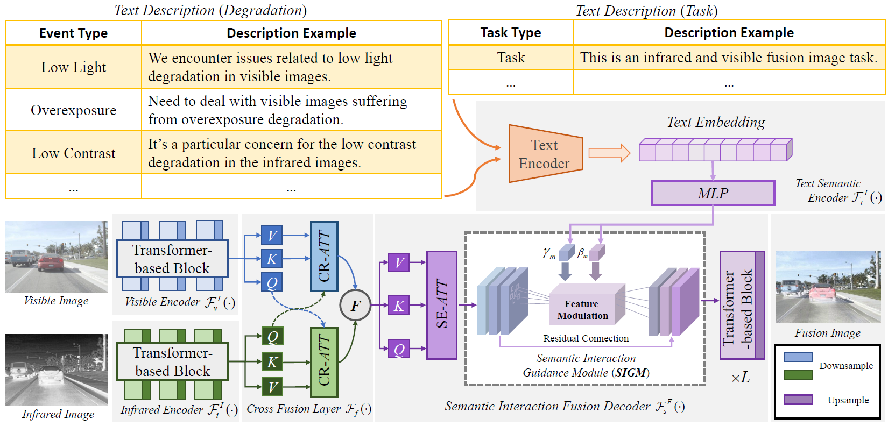

# [TIP 2025] TSANet: Text-Guided Semantic Alignment Network with Spatial-Frequency Interaction for Infrared-Visible Image Fusion under Extreme Illumination
### [Paper](https://ieeexplore.ieee.org/abstract/document/11267268) | [Code](https://github.com/WentaoLi-CV/TSANet) 

**TSANet: TSANet: Text-Guided Semantic Alignment Network with Spatial-Frequency Interaction for Infrared-Visible Image Fusion under Extreme Illumination**

Guanghui Yue, Wentao Li, Cheng Zhao, Zhiliang Wu, Tianwei Zhou and Qiuping Jiang




## 1. Create Environment
- Create Conda Environment
```
conda create -n tsanet_env python=3.8
conda activate tsanet_env
```
- Install Dependencies
```
pip install -r requirements.txt
```

## 2. Prepare Your Dataset

Download MIMF Dataset
- [*[Google Drive]*](https://drive.google.com/drive/folders/1TXYByOXv3HvxEJh_WFIpNwogw0rJh2II?usp=sharing)
- [*[Baidu Yun]*](https://pan.baidu.com/s/1ywK6s74XNGhwZR4ENzD1mQ?pwd=uq46) 提取码: uq46

Note: The current release of the MIMF dataset only includes the test subset. If you require the training subset for your research or development, please feel free to contact me.

You can also refer to [TNO](https://figshare.com/articles/dataset/TNO_Image_Fusion_Dataset/1008029) / [FMB](https://github.com/JinyuanLiu-CV/SegMiF) to prepare your data. You should list your dataset as followed rule:
```bash
    dataset/
        your_dataset/
            train/
                vis/
                ir/
                text_vis/
                text_ir/
            eval/
                vis/
                ir/
                text_vis/
                text_ir/
```

## 3. Pretrained Weights

- [*[Google Drive]*](https://drive.google.com/drive/folders/1TXYByOXv3HvxEJh_WFIpNwogw0rJh2II?usp=sharing)
- [*[Baidu Yun]*](https://pan.baidu.com/s/1ywK6s74XNGhwZR4ENzD1mQ?pwd=uq46) 提取码: uq46

## 4. Test
For general image fusion performance comparison, please do not input the text with degradation prompt to ensure relative fairness.
```shell
# MFNet
CUDA_VISIBLE_DEVICES=0 python test_from_dataset.py  --weights_path "pretrained_weights/simple_fusion.pth" --dataset_path "./dataset/MFNet/eval" --input_text "This is the infrared and visible light image fusion task." --save_path "./results"

# RoadScene
CUDA_VISIBLE_DEVICES=0 python test_from_dataset.py  --weights_path "pretrained_weights/simple_fusion.pth" --dataset_path "./dataset/RoadScene/eval" --input_text "This is the infrared and visible light image fusion task."  --save_path "./results"

# LLVIP
CUDA_VISIBLE_DEVICES=0 python test_from_dataset.py  --weights_path "pretrained_weights/simple_fusion.pth" --dataset_path "./dataset/LLVIP/eval" --input_text "This is the infrared and visible light image fusion task."  --save_path "./results"
```

For text guidance image fusion, the existing model supports hints for low light, overexposure, low contrast, and noise. Feel free to use it.
```shell
# Low light
CUDA_VISIBLE_DEVICES=0 python test_from_dataset.py  --weights_path "pretrained_weights/text_fusion.pth" --dataset_path "./dataset/your_dataset/eval" --input_text "In the context of infrared-visible image fusion, visible images are susceptible to extremely low light degradation." --save_path "./results"

# Overexposure
CUDA_VISIBLE_DEVICES=0 python test_from_dataset.py  --weights_path "pretrained_weights/text_fusion.pth" --dataset_path "./dataset/your_dataset/eval" --input_text "We're tackling the infrared-visible image fusion challenge, dealing with visible images suffering from overexposure degradation." --save_path "./results"

# Low contrast
CUDA_VISIBLE_DEVICES=0 python test_from_dataset.py  --weights_path "pretrained_weights/text_fusion.pth" --dataset_path "./dataset/your_dataset/eval" --input_text "In this challenge, we're addressing the fusion of infrared and visible images, with a specific focus on the low contrast degradation in the infrared images." --save_path "./results"

# Noise
CUDA_VISIBLE_DEVICES=0 python test_from_dataset.py  --weights_path "pretrained_weights/text_fusion.pth" --dataset_path "./dataset/your_dataset/eval" --input_text "We're working on the fusion of infrared and visible images, with special consideration for the noise degradation affecting the infrared captures." --save_path "./results"
```

### News: Text-IF supports handling more degradation (all types in EMS) and more powerful text prompts. 
The model weights for more degradation have now been made publicly available in [Google Drive](https://drive.google.com/file/d/1jstLiOp-ZBppz_vZhyG55YeUYFLyOdrP/view?usp=sharing) | [Baidu Drive](https://pan.baidu.com/s/1wydIlgurftN5tyCa6Nt7mg) (code: rwth). 

We only recommend using this weight when handling a large number of degradations. In general, we recommend using the previously mentioned at `Pretrained Weights` for text guidance image fusion.
```shell
# vis Low light
CUDA_VISIBLE_DEVICES=0 python test_from_dataset.py  --weights_path "pretrained_weights/text_fusion_power.pth" --dataset_path "./dataset/your_dataset/eval" --input_text "In the context of infrared-visible image fusion, visible images are susceptible to extremely low light degradation." --save_path "./results"

# vis Overexposure
CUDA_VISIBLE_DEVICES=0 python test_from_dataset.py  --weights_path "pretrained_weights/text_fusion_power.pth" --dataset_path "./dataset/your_dataset/eval" --input_text "We're tackling the infrared-visible image fusion challenge, dealing with visible images suffering from overexposure degradation." --save_path "./results"

# vis Random noise
CUDA_VISIBLE_DEVICES=0 python test_from_dataset.py  --weights_path "pretrained_weights/text_fusion_power.pth" --dataset_path "./dataset/your_dataset/eval" --input_text "The goal is to effectively fuse infrared and visible light images, mitigating the random noise present in visible images." --save_path "./results"

# vis Haze
CUDA_VISIBLE_DEVICES=0 python test_from_dataset.py  --weights_path "pretrained_weights/text_fusion_power.pth" --dataset_path "./dataset/your_dataset/eval" --input_text "We're tackling the fusion of infrared and visible light images, specifically focusing on haze issues in the visible images." --save_path "./results"

# vis Rain
CUDA_VISIBLE_DEVICES=0 python test_from_dataset.py  --weights_path "pretrained_weights/text_fusion_power.pth" --dataset_path "./dataset/your_dataset/eval" --input_text "This is the infrared-visible light fusion task, where visible images are affected by rain degradation." --save_path "./results"

# vis Blur
CUDA_VISIBLE_DEVICES=0 python test_from_dataset.py  --weights_path "pretrained_weights/text_fusion_power.pth" --dataset_path "./dataset/your_dataset/eval" --input_text "This task involves integrating infrared and visible light images, focusing on the degradation caused by blur in visible images." --save_path "./results"

# ir Low contrast
CUDA_VISIBLE_DEVICES=0 python test_from_dataset.py  --weights_path "pretrained_weights/text_fusion_power.pth" --dataset_path "./dataset/your_dataset/eval" --input_text "In this challenge, we're addressing the fusion of infrared and visible images, with a specific focus on the low contrast degradation in the infrared images." --save_path "./results"

# ir Stripe noise
CUDA_VISIBLE_DEVICES=0 python test_from_dataset.py  --weights_path "pretrained_weights/text_fusion_power.pth" --dataset_path "./dataset/your_dataset/eval" --input_text "This pertains to the fusion of infrared and visible light images, with an emphasis on addressing stripe noise degradation in the infrared images." --save_path "./results"

# ir Random noise
CUDA_VISIBLE_DEVICES=0 python test_from_dataset.py  --weights_path "pretrained_weights/text_fusion_power.pth" --dataset_path "./dataset/your_dataset/eval" --input_text "We're working on the fusion of infrared and visible images, with special consideration for the noise degradation affecting the infrared captures." --save_path "./results"
```
### Gallery

From left to right are the infrared image, visible image, and the fusion image obtained by Text-IF with the text guidance.


## 5. Training
Please prepare the training data as required from the EMS dataset. 
```bash
    dataset/
        dataset/
            train/
              # The infrared and visible images are low quality by default.
              type_degradation_1/
                  Infrared/
                  Infrared_gt/
                  Visible/
                  Visible_gt/
                  text/
              type_degradation_2/
                  Infrared/
                  Infrared_gt/
                  Visible/
                  Visible_gt/
                  text/
              type_degradation_3/
                  ...
            eval/
                Infrared/
                Visible/
                # You can enter the text while running the code, the text folder is optional here.
```
Modify the text prompt path in the `scripts/utils.py` to the corresponding configuration file and the dataset path in the `train_fusion.py`.
After that, run the following command:
```shell
python train_fusion.py
```

## Citation
If you find our work or dataset useful for your research, please cite our paper. 
```
@inproceedings{yi2024text,
  title={Text-IF: Leveraging Semantic Text Guidance for Degradation-Aware and Interactive Image Fusion},
  author={Yi, Xunpeng and Xu, Han and Zhang, Hao and Tang, Linfeng and Ma, Jiayi},
  booktitle={Proceedings of the IEEE/CVF Conference on Computer Vision and Pattern Recognition (CVPR)},
  year={2024}
}
```
If you use the dataset of another work, please cite them as well and follow their licence. Here, we express our thanks to them. 
If you have any questions, please send an email to xpyi2008@163.com. 
