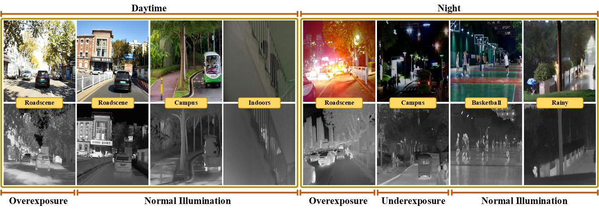

# [TIP 2025] TSANet: Text-Guided Semantic Alignment Network with Spatial-Frequency Interaction for Infrared-Visible Image Fusion under Extreme Illumination
### [Paper](https://ieeexplore.ieee.org/abstract/document/11267268) | [Code](https://github.com/WentaoLi-CV/TSANet) 

**TSANet: TSANet: Text-Guided Semantic Alignment Network with Spatial-Frequency Interaction for Infrared-Visible Image Fusion under Extreme Illumination**

Guanghui Yue, Wentao Li, Cheng Zhao, Zhiliang Wu, Tianwei Zhou and Qiuping Jiang


## 1. Create Environment
- Create Conda Environment
```
conda create -n tsanet_env python=3.8
conda activate tsanet_env
```
- Install Dependencies
```
pip install -r requirements.txt
```

## 2. Prepare Your Dataset



Download MIMF Dataset
- [*[Google Drive]*](https://drive.google.com/drive/folders/1TXYByOXv3HvxEJh_WFIpNwogw0rJh2II?usp=sharing)
- [*[Baidu Yun]*](https://pan.baidu.com/s/1ywK6s74XNGhwZR4ENzD1mQ?pwd=uq46) 提取码: uq46

Note: The current release of the MIMF dataset only includes the test subset. If you require the training subset for your research or development, please feel free to contact me.

You can also refer to [TNO](https://figshare.com/articles/dataset/TNO_Image_Fusion_Dataset/1008029) / [FMB](https://github.com/JinyuanLiu-CV/SegMiF) to prepare your data. You should list your dataset as followed rule:
```bash
    dataset/
        your_dataset/
            train/
                vis/
                ir/
                text_vis/
                text_ir/
            eval/
                vis/
                ir/
                text_vis/
                text_ir/
```

## 3. Pretrained Weights

- [*[Google Drive]*](https://drive.google.com/drive/folders/1USpc8A5Rn_GggSdrRoEF1BuQRBLpykHC?usp=sharing)
- [*[Baidu Yun]*](https://pan.baidu.com/s/1pv0x6xqXk1uf7-XOpzy7uQ?pwd=dmh7) 提取码: dmh7

## 4. Test

```shell
CUDA_VISIBLE_DEVICES=1 python test.py --weights_path /path/to/your/checkpoint --save_path path/to/your/result
```

## 5. Training

Modify the corresponding address in `train.sh`.
After that, run the following command:
```shell
bash train.sh tsanet
```

## Citation
If you find our work or dataset useful for your research, please cite our paper. 
```
@ARTICLE{11267268,
  author={Yue, Guanghui and Li, Wentao and Zhao, Cheng and Wu, Zhiliang and Zhou, Tianwei and Jiang, Qiuping and Cong, Runmin},
  journal={IEEE Transactions on Image Processing}, 
  title={Text-Guided Semantic Alignment Network With Spatial-Frequency Interaction for Infrared-Visible Image Fusion Under Extreme Illumination}, 
  year={2025},
  volume={34},
  number={},
  pages={7943-7958},
  keywords={Semantics;Image fusion;Feature extraction;Visualization;Lighting;Decoding;Annotations;Electronic mail;Biomedical imaging;Fuses;Infrared-visible image fusion;text-guided semantic alignment;spatial-frequency interaction;extreme illumination},
  doi={10.1109/TIP.2025.3635048}}
```
